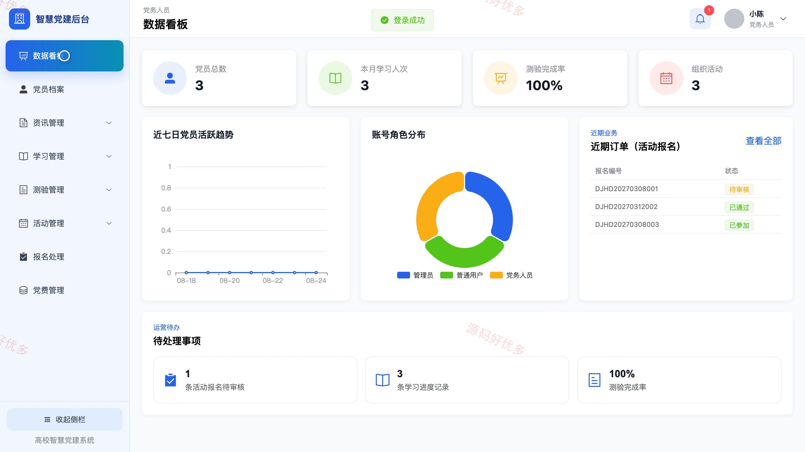
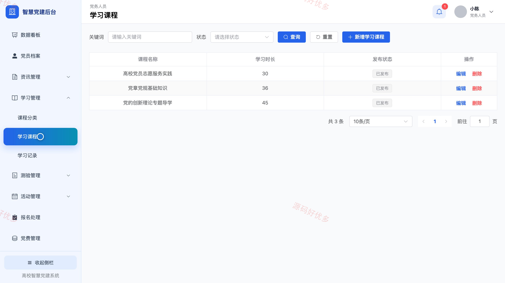
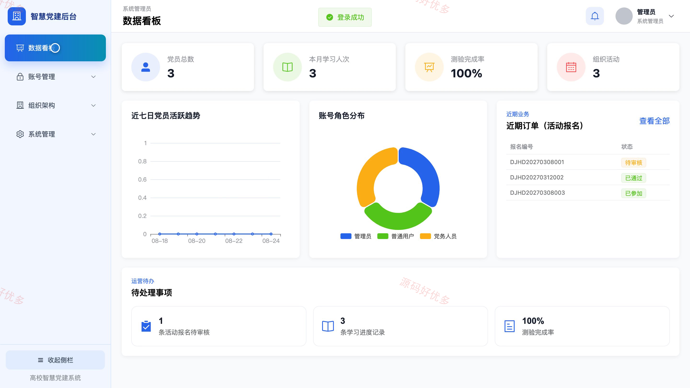
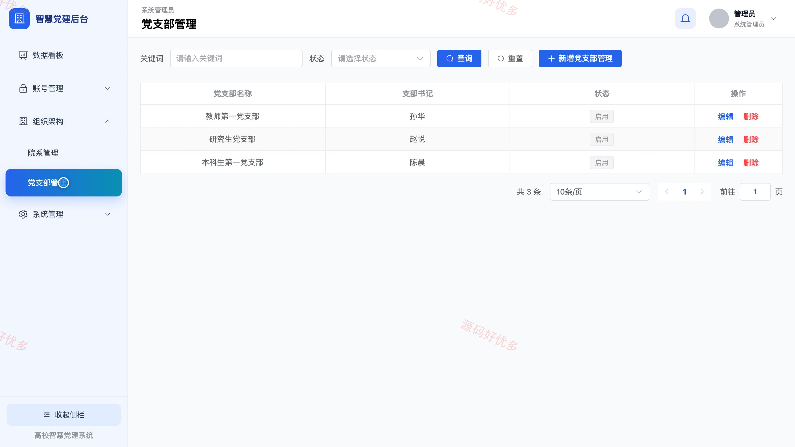

## 源码问题查看主页咨询

### 一、关键词
高校党建、智慧党建、党员教育、党务管理、组织生活

### 二、作品包含
源码+数据库+万字设计文档+PPT+全套环境和工具资源+本地部署教程

### 三、项目技术
前端技术： Html、Css、Js、Vue3.4、Element-Plus
后端技术：Java、SpringBoot3.2.0、MyBatis-Plus

### 四、运行环境（以下版本亲测，其他版本兼容性请自行测试）
开发工具：IDEA/eclipse + VSCODE

数据库：MySQL5.7+（共19张表）

数据库管理工具：Navicat10以上版本

环境配置软件： JDK17 + Maven

前端Nodejs：16+

浏览器：谷歌浏览器

### 五、项目介绍
项目编号：bs061A

系统面向高校党员教育与党务管理，提供党建资讯、专题学习、在线测验、组织活动报名、党费查询，以及党员档案、组织架构、权限和统计管理，覆盖党员用户、党务人员与系统管理员三类角色。

角色：党员用户、党务人员、系统管理员

党员用户功能：党建资讯、专题学习、学习收藏与记录、在线测验、组织活动报名、党费查询、个人资料与密码、学习积分与排行。

党务人员功能：党员档案管理、党建资讯与公告管理、学习资料管理、题库试卷管理、测验成绩管理、组织活动与报名审核、党费记录管理、学习情况统计。

系统管理员功能：党员与党务人员账号管理、角色权限管理、院系管理、党支部管理、全校公告管理、基础分类管理、数据看板、操作日志。

### 六、运行截图

